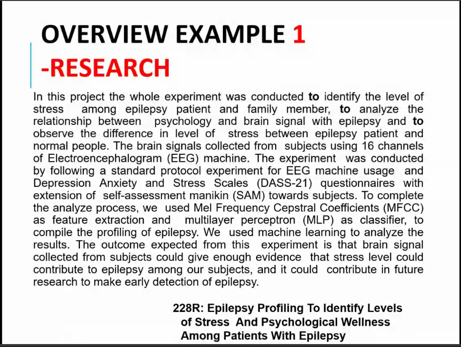
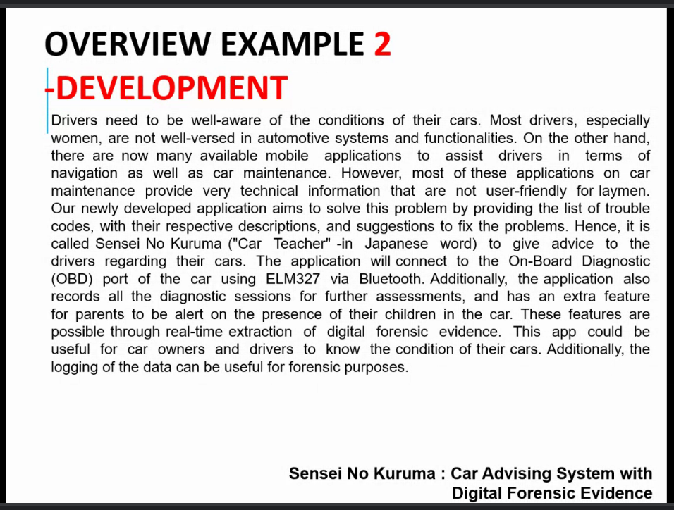

# FYP 1 SEM 2 2021/22

## TO DO LIST

**7th April 2022**
- Submit review of previous work to Dr. Hamwira

***

**Progress Report**

- [ ] Project Information
- [ ] Introduction
  - [ ] Project Overview
    - Short description 1 paragraph
    - Begining of proposal
    - Explains everything bout your project
    - 
    - 
  - [ ] Problem Statement
    - Elaborate problem to solve
    - 1 or 2 sentence
    - Outline the negative points of current problem and why it matters
  - [ ] Project Objective
  - [ ] Significance of Project
    - How useful to the target user
  - [ ] Project Schedule
    - Gantt Chart
- [ ] Review of Previous Work
  - Around 8-10 related papers
    - What's their problem, how they solve, which methodology
    - Look at the abstract of the paper
    - list reference APA style
- [ ] Methodology
  - Explain process taken to achieve your project
  - Can include flowchart showing your flow
  - [ ] Design
    - System, interfacem database, data collection
  - [ ] Implementation
    - How collect data, develop algorithm, build database, ui
  - [ ] Testing
    - Functional (system spec, requirement)
    - Non-functional (performance, security)
- [ ] Progress
  - Explain in what have you acieved
  - **DON'T LEAVE EMPTY!!!***

***

### Related Work

1. [The Process of Falling Asleep p. 3-8](https://sci-hub.se/10.1053/smrv.2001.0145)
2. [BCI in VR and IoT](https://sci-hub.se/10.1109/ACCESS.2018.2809453)
3. [Rasberry Pi IoT github repo](https://github.com/WebThingsIO/wiki/wiki)
4. [On the Use of the EMOTIV Cortex API to Control a Robotic Arm Using Raw EEG Signals Acquired from the EMOTIV Insight NeuroHeadset](https://sci-hub.se/10.1109/CHILECON47746.2019.8987541)
5. [A Smart Home Automation technique with Raspberry Pi using IoT](https://ieeexplore.ieee.org/abstract/document/7873584)
6. [Smart Home Control by using Raspberry Pi & Arduino UNO](assets/Smart_Home_Control_by_using_Raspberry_Pi.pdf)

***

### Reading Articles

***

> ### Brain Computer Interface Advancement in Neurosciences: Applications and Issues
> *Mudgal S. K., Sharma S. K., Chaturvedi J., Sharma A.*
>
> **Introduction**  
> - Brain Computer Interface (BCI) provides direct communication between brain and bio-monitoring devices
> - Does not involve any muscle or neuromuscular pathway to communicate
> - Good to utilized in a paralyzed but conscious patient
> - Before BCI used for physically disabled patients -> hand free devices
> 
> **What is BCI**  
> A brain-computer interface (BCI) is a technology that receives, analyzes, and transfer the signals generated from brain into output commands in real world to accomplish a particular task
>
> **Types of BCIs**  
> 
> *13. BCI and Entertainment & Games*
> - Flying helicopters to any point either 2D or 3D world
> - The Brain Arena
>   : Football video game where can score goal by imagine left or  right hand movement
>   : Player that is more relax and calmer usually wins
>   : Could help with reduce stress and learn self control
>
> **BCIs Drawback**
>
> *1. Neuro-psycho-physiological Issues*
> - Anatomy of brain could be too diverse
> - Some people genetically couldn't produce sufficient signals for it to work
> - Psychological like attention, memory, fatigue, stress, emotion.
> - Person characteristics like age, gender, life-style
>
> *2. Technological Issues*
>
> *3. Ethical Issues*
> 

***

> ### Differences between EEG during thermal discomfort and thermal displeasure
> *Jieun Han, Chungyoon Chun*
>
> **Important Points**
> - EEG changes based on thermal displeasure and discomfort have different tendencies.
> - Beta and gamma powers increased and theta power decreased significantly by thermal displeasure.
> - EEG power was increased at all frequencies by thermal discomfort.
> - EEG changes are prominent with sudden temperature changes.
> 

***

### Extras

1. [EEG microstate when imagine movement of hand](https://sci-hub.se/10.1080/24699322.2017.1389404)
2. [Telephatic Virtual Assistant](https://ieeexplore.ieee.org/abstract/document/8824886)
3. [Brain–Computer Interface (BCI) Control of a Virtual Assistant in a Smartphone to Manage Messaging Applications](assets/BCI-control-of-virtual-assistant.pdf)
4. [Using Passive BCI to Online Control Air Cond](assets/Using_passive_BCI_to_online_control_the_air_conditioner_for_obtaining_the_individual_specific_thermal_comfort_.pdf)
5. [Home Automation using EMOTIV: Controlling TV by Brainwaves](assets/Home_Automation_using_EMOTIV_Controlling_TV_by_Brainwaves.pdf)
